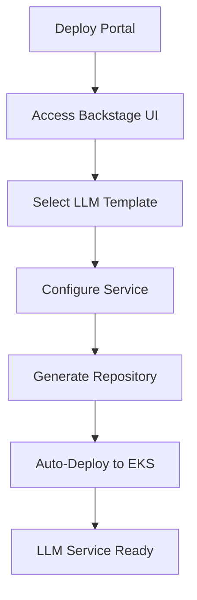

# 🎉 Service LLM Template Portal - Complete Setup Summary

## 📋 What We've Built

You now have a **complete, independent DevOps portal** for creating and managing LLM Gateway services. This replaces your dependency on `backstage-loc`, `platform-devportal`, and individual `service-llm` repositories.

## 🏗️ Architecture Overview

```
service-llm-template/
├── 🎯 Single Source of Truth
├── 🚀 Self-Deployable to EKS  
├── 📝 Complete Template System
└── 🔄 Full CI/CD Pipeline
```

### Core Components

1. **📱 Backstage Portal** (`./backstage/`)
   - Complete Node.js application
   - Production-ready Docker container
   - Helm charts for EKS deployment
   - GitHub integration for `bd-core-svcs` org

2. **📋 LLM Service Template** (`./template.yaml` + `./skeleton/`)
   - Comprehensive service scaffolding
   - Multi-provider LLM gateway (Azure, AWS, OpenAI)
   - Optional PostgreSQL, Redis, Auth0 integration
   - Kubernetes-native deployment

3. **🚀 Deployment Automation** (`./deploy-backstage.sh`, `./Makefile`)
   - One-command EKS deployment
   - Automated secret management
   - Health check verification
   - Comprehensive workflow commands

4. **🔄 CI/CD Pipelines** (`./.github/workflows/`)
   - Automated Backstage deployment
   - Template validation
   - Container image building and publishing

## 🚀 Deployment Process

### 1. Quick Start (Production)
```bash
git clone https://github.com/bd-core-svcs/service-llm-template.git
cd service-llm-template
./deploy-backstage.sh
```

### 2. Access Portal
- **URL**: https://llm-template.platform.duckutil.net
- **Login**: GitHub OAuth
- **Organization**: `bd-core-svcs`

### 3. Create LLM Services
1. Navigate to "Create" → "Choose a template"
2. Select "LLM Gateway Service"
3. Configure service parameters
4. New repository automatically created in `bd-core-svcs` org

## 🔧 Key Features

### ✅ Independence
- **No external dependencies** on other repositories
- **Self-contained** Backstage instance
- **Complete** template system
- **Automated** deployment workflows

### ✅ Production Ready
- **EKS deployment** with Helm charts
- **SSL termination** and ingress configuration
- **PostgreSQL** for persistent storage
- **GitHub App integration** for enhanced security

### ✅ Template Capabilities
- **Multi-provider LLM support** (Azure OpenAI, AWS Bedrock, OpenAI)
- **Optional components** (PostgreSQL, Redis, Auth0)
- **Kubernetes-native** deployment with Helm
- **CI/CD pipelines** included in generated services

### ✅ Developer Experience
- **Comprehensive Makefile** with 20+ commands
- **Local development** support
- **Health checks** and monitoring
- **Detailed documentation** and troubleshooting

## 🎯 Usage Workflow



## 📊 Impact

### Before (Dependencies)
- ❌ Multiple repositories to maintain
- ❌ Complex setup across platforms
- ❌ Manual template synchronization
- ❌ Fragmented documentation

### After (service-llm-template)
- ✅ **Single repository** for everything
- ✅ **One-command deployment** to EKS
- ✅ **Automated** repository creation
- ✅ **Comprehensive** documentation and workflows

## 🔍 Monitoring & Operations

### Status Dashboard
```bash
make status              # Complete system status
make backstage-status    # Kubernetes deployment status
make backstage-logs      # Real-time logs
make urls               # All access URLs
```

### Health Checks
- **Portal**: https://llm-template.platform.duckutil.net/healthcheck
- **Kubernetes**: Liveness and readiness probes
- **GitHub**: Repository creation validation

## 🛡️ Security Features

### GitHub Integration
- **GitHub Apps** for enhanced permissions
- **OAuth authentication** for users
- **Organization-scoped** repository creation
- **Secret management** via Kubernetes secrets

### Kubernetes Security
- **Non-root containers** with security contexts
- **Resource limits** and requests
- **Network policies** (configurable)
- **RBAC** integration

## 📈 Scalability

### Backstage Portal
- **Auto-scaling** HPA configuration
- **Load balancing** via Kubernetes service
- **PostgreSQL** for reliable data persistence
- **Resource monitoring** with Prometheus

### Generated Services
- **Individual scaling** per service
- **Independent deployments** with Helm
- **Dedicated namespaces** for isolation
- **Service mesh** compatibility

## 🎓 Training & Adoption

### For Developers
1. **Access portal** at production URL
2. **Create first service** using template
3. **Understand generated structure** 
4. **Customize** for specific needs

### For Operations
1. **Monitor portal** health and usage
2. **Manage secrets** and configurations
3. **Scale resources** as needed
4. **Update templates** for new requirements

## 🔮 Future Enhancements

### Template Additions
- **Additional LLM providers** (Google Vertex AI, Anthropic)
- **Advanced monitoring** templates (Grafana, Alerting)
- **Service mesh** integration (Istio)
- **Security scanning** pipelines

### Portal Features
- **Template marketplace** with multiple categories
- **Usage analytics** and dashboards
- **Policy enforcement** and compliance
- **Integration** with other platforms

## 📞 Support & Maintenance

### Documentation
- **Comprehensive README** with troubleshooting
- **Inline code comments** for maintenance
- **Architecture diagrams** for understanding
- **Operational runbooks** for common tasks

### Monitoring
- **Application logs** via `make backstage-logs`
- **Kubernetes events** monitoring
- **GitHub webhook** validation
- **Template usage** tracking

## 🎯 Success Metrics

### Adoption Metrics
- **Services created** per month
- **Active users** in the portal
- **Template usage** patterns
- **Deployment success** rates

### Operational Metrics
- **Portal uptime** (target: 99.9%)
- **Service creation time** (target: <5 minutes)
- **Template validation** success rate
- **Developer satisfaction** scores

---

## 🏆 Conclusion

You now have a **complete, production-ready LLM service creation platform** that:

✅ **Eliminates dependencies** on external repositories  
✅ **Automates end-to-end** service creation workflow  
✅ **Scales** to support multiple teams and services  
✅ **Integrates** seamlessly with existing GitHub workflows  
✅ **Provides** comprehensive documentation and support  

**🎉 Ready to deploy and start creating LLM services immediately!**
